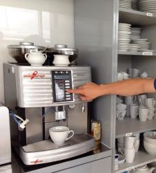
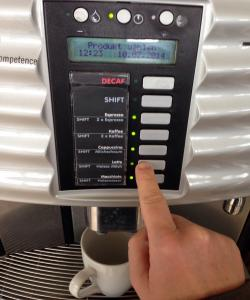
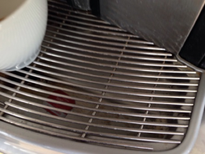
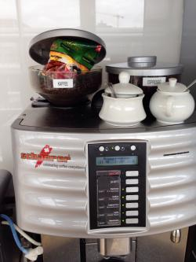
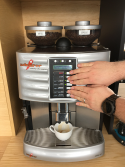

# Szenario # 
"Benutzung eines Kaffeeautomaten"

## Standardfall
Eine Tasse Kaffee (ohne Milch) auswählen

## Alternative
Eine Tasse Milchkaffee (Latte) auswählen

## Ausnahme
Die Tropfschale (Auffangbecken) ist vollgelaufen. 
Ein weiteres Heißgetränk kann erst bezogen werden, wenn die Schale zuvor geleert wurde.

## Negativfall
Kaffeebohnen werden nicht korrekt nachgefüllt. 
Der Automaten gibt keinen Kaffee aus.

## Missbrauch
Auf mehr als einen oder alle Knöpfe für die Getränkeauswahl gleichzeitig drücken.

