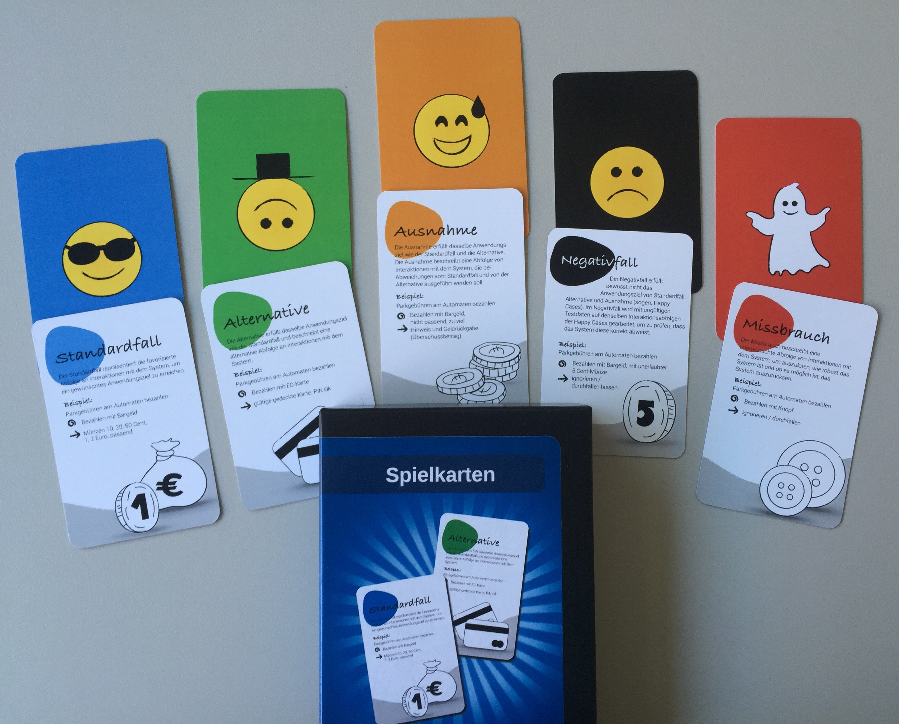

________

Die Szenariokarten sind aus der Forschung & Entwicklung des MaibornWolff Software Testing Bereiches entstanden.

The scenario maps are the result of research and development in the MaibornWolff Software Testing division.

Warum?
1. Als Quelle für Testideen und die Erstellung von Testfällen eignen sich Szenarien gut.
2. Szenarien als Impulsgeber / Treiber für das Erstellen von vielseitigen Testfällen.
3. Sammlung als erste grafische Notizen dienen als Grundlage für die zu erstellenden ausführlicheren Testfälle.
4. Szenariobasierter Testentwurf fördert nicht selten neue Anforderungen zu Tage.

Why?
1. Scenarios are a good source for test ideas and the creation of test cases.
2. Scenarios as impulse generator / driver for the creation of versatile test cases.
3. Collection as first graphical notes serve as a basis for the more detailed test cases to be created.
4. Scenario-based test design often brings new requirements to light.

# Inhalt #
1. [Spielkarten zum Ausdrucken (A1 Format)](Szenariobasierte_A1_Plakate_DE.pdf)
2. [Spielanleitung](./Anleitung.md)
3. [Spielvarianten](./Spielvarianten.md)
4. [Definitionen](./Definitionen.md)
5. [Blogposts und Leselinks](./Leselinks.md)
6. [Beispielszenarien](./Beispielszenarien)
  * [Kaffeeautomat](./Beispielszenarien/Kaffeeautomat.md)
  * [Navigationssystem](./Beispielszenarien/Navigationssystem.md)
  * [Anmeldedialog](./Beispielszenarien/Anmeldedialog.md)  

# Content (!! WIP !!)
1. [Playing cards for printing (A1 format)](Szenariobasierte_A1_Plakate_DE.pdf)
2. [Game manual](./Anleitung.md)
3. [Game variants](./Spielvarianten.md)
4. [Blogposts and reading recommendations](./Leselinks.md)
5. [Examples](./Beispielszenarien)
  * [Coffee machine](./Beispielszenarien/Kaffeeautomat.md)
  * [Navigation system](./Beispielszenarien/Navigationssystem.md)
  * [Login dialog](./Beispielszenarien/Anmeldedialog.md)  

# Lizenz / License # 
[No license. All rights reserved](./LICENSE)